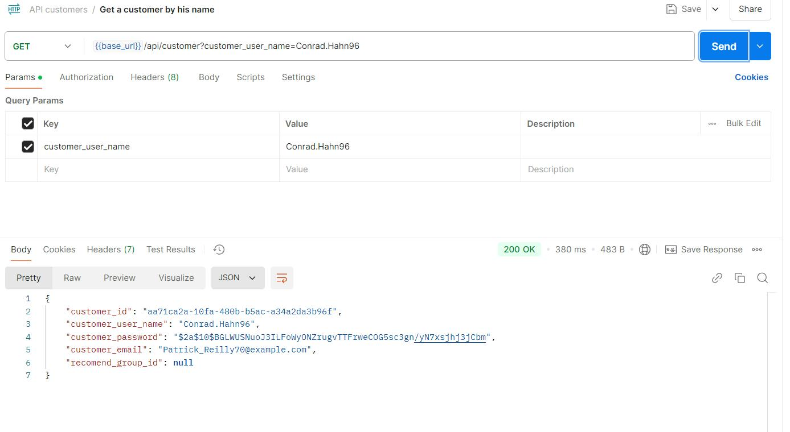
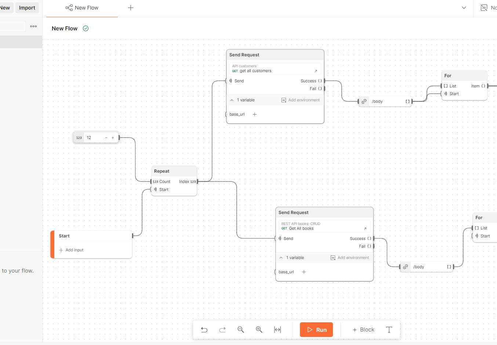
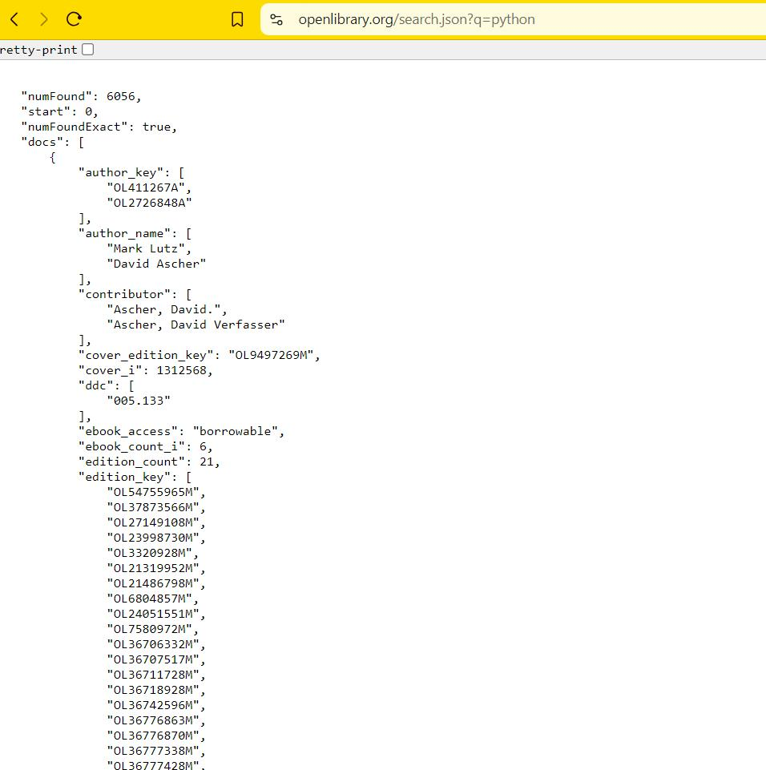

# Sistema de análisis de compra de usuarios de una tienda e-commerce

## Caso de uso
**Resumen**
El propósito principal del sistema es ser una herramienta que sea capaz determinar u optimizar las estrategias y decisiones del equipo de marketing de una empresa de ventas de libros digitales, mediante el análisis de patrones de compra del cliente.

**Publico objetivo:** Empresas que busquen una herramienta capaz de optimizar sus estrategias de venta.

**Fortalezas:**
- Intuitiva y fácil de usar.
- Mejora la experiencia de compra del usuario mediante recomendaciones personalizadas.

**Beneficios:**
- Ayuda a los administradores a identificar tendencias y preferencias del mercado.
- Incrementa la fidelidad del cliente gracias a estrategias de marketing basadas en datos.

### Objetivo General
Diseñar y desarrollar un sistema que permita el análisis de las compras de libros por parte de los usuarios para mejorar la experiencia del cliente y optimizar las estrategias comerciales de las tiendas de libros.
Objetivos Específicos:
- Identificar patrones de compra por medio del análisis de datos de las ventas de libros.
- Con el modelo creado implementar un sistema de recomendaciones de libros personalizadas.
- El sistema debe ser capaz de ayudar en la optimización al gestionar el inventario basándose en las tendencias de compra proyectadas.
- Visualización de datos para el análisis de datos y exportación de datos en Excel para crear reportes.

_Caso de uso tomando en cuenta los objetivos del proyecto_

**Alcance**
El proyecto abarcará el desarrollo de un sistema de microservicios compuesto por:
- Un módulo de observabilidad de los datos.
- Microservicio de herramienta interactiva de visualización de datos.
	- Herramienta BI seleccionada metabase.
- Inicio de sesión del sistema.
	- API log in.
- Módulo de órdenes del usuario y libros.
	- API de ordenes de usuario y CRUD de libros.

**Solución Propuesta**
Se propone el desarrollo de un sistema basado en microservicios, el cual incluye:
- Sistema BI para visualización de datos que facilitará el análisis interactivo de datos.
- Infraestructura escalable empleando contenedores y orquestadores como Docker los que podrán ser montados en nodos en una arquitectura en la nube.

_Diagrama módulos del sistema._

_Modelado de entidad de relación para la base de datos._

## Base de datos

_Tabla de usuarios y libros además se crea la extensión uuid-ossp para el uso de UUIDs._

Función y vista almacenada

- Función para extraer el campo UUID de un usuario utilizando su username.
- Vista es un simple join entre la tabla usuario (customer) y  ventas (order) que muestra la fecha y usuario que realizo la compra.

_Contenedor de la base de datos._

## # RESTful API:

Las conexiones a la base de datos cuentan con dos servidores API:

REST Customer CRUD:

Los endpoint planteados para el desarrollo de la api eran los siguientes:
- GET /customers
- POST /customer inserter nuevo usuario.
- GET /customer/{customer_id} Seleccionar usuario.
- DELETE /customer/{customer_id} Eliminar usuario por medio de su ID.

Desarrollo coneccion al servidor de la API Customers:

_Servidor escrito en express hace uso de las variables de entorno encontradas en el archivo .env._

_Modelado de datos: Creación de querys y modelado de los datos para inserción en la base de datos._

Como se aprecia el hashing de contraseñas se realiza desde la parte de la API con el algorithmo bcrypt de encriptación.

_Diferentes funciones para los métodos HTTP, dentro de try catch con el uso de códigos de error HTTP, 400, 500 y códigos exitosos 200._

Rutas

Archivo server.js principal con el inicio de escucha del servidor API.

API CRUD de libros:

Utiliza el mismo archivo **.env**.

Métodos GET, POST para Extraer e insertar datos.

Método PUT para actualizar datos de un libro.

DELETE para eliminar un libro por medio de su UUID.

`POST` para la creación de una nueva orden.

## Pruebas

Pruebas de funcionamiento de las API, mediante el uso de Postman.

Se muestra el contenido de la variable base_url de la colección API customers.

Request satisfactorio GET todos los usuarios.

Creación de un nuevo usuario con parámetros aleatorios.

 Obtener usuario por medio de su username. 

Test de funcionamiento en Postman Flow

El test comprende de tres request, dos GET de libros y usuarios y un POST de venta, se toma en un for loop las UUIDv4 de un usuario, libro y se realiza una venta aleatoria.

Salidas satisfactorias

## # Observabilidad

Para la visualización de datos utilice la herramienta metabase:

Herramienta utilizada **metabase**.

**Razones:** Por su uso intuitivo fácil manejo para administradores con conocimientos básicos de SQL, además de ser una herramienta de código abierto la hace una herramienta BI muy atractiva incluso para empresas de gran tamaño.

Imagen docker

Se muestra la imagen utilizada <b>metabase/metabase</b> para el levantamiento del servicio observability con Docker-compose.

Levantamiento del servidor.

**Configuración y conexión con la base de datos:**

Luego configure la conexión con la base de datos y el usuario administrador del visualizador.

Visualización del dashboard principal

Se muestran distintos gráficos de análisis de compra de usuario; Mejores libros vendidos entre otros.

Script utilizados para el desarrollo del dashboard en **metabase**:
Gráfico de más vendidos

Se trata de un join entre las tablas book y order_items, que agrupa por título de libro.

Ganancias por libro

Libros más comprados en la tienda, se compone de otro join entre las tablas **book** y **order_items** esta vez para tomar el total de libros vendidos, metabase se encarga de mostrarlo como un gráfico de tarta.

Script de mayores compradores

Es un join entre order, order_items y book agrupado por email, username y ordenado de manera descendente.

## # Sistema ETL (Extract, Transform, Load).

Herramienta utilizada: Airbyte.

Razones: Es una herramienta simple de usar y no-code a la hora de realizar las conexiones a distintas API.

Los datos a extraer, se tratan de datos de búsqueda de una librería API gratuita, para la inserción masiva de datos de libros para nuestro sistema de venta de libros.

Extracción de json crudo con búsqueda Python (?q=python) mediante la API Open Library.

Para la instalación de Airbyte tuve que clonar el repositorio ejecutar un script para y luego levantar el proyecto de manera local con el archivo generado Docker-compose.yml

Archivos principales de la herramienta Airbyte.

Alguno de los contenedores necesarios para el funcionamiento de la herramienta ETL Airbyte levantados con el archivo Docker-compose.yml generado por el script bash .sh.

Dashboard Airbyte luego de ser configurado las conexiones de fuentes y destino de los datos.

Configuración de la **extracción** de datos

Con el endpoint https://openlibrary.org/search.json?q={{ config['search_id'] }} Se realizara una búsqueda de la cual los libros emergentes serán grabados en la base de datos.

Se crea una variable search_id para cambiar la frase a buscarluego de haber creado el modelo de extracción de datos ( {{ config['search_id'] }} ).

Palabra para buscar: golang.

**Transformación** de los datos:

Se muestran las transformaciones eliminación y renombrado de ítems de las salidas json, para que concuerden con los datos de la base de datos.

Nuevo formato de las entradas json, luego de la transformación.

Programación de la **carga** de datos en la base de datos.

Carga de los datos en el servidor postgres

Se muestra la carga satisfactoria de 100 libros en la base de datos

Muestran los datos cargados en la base de datos por medio del visualizador metabase.

## # Conclusión

El sistema desarrollado combina herramientas y tecnologías avanzadas como microservicios, Docker, ETL con Airbyte y visualización de datos mediante Metabase, proporcionando una solución integral para optimizar las operaciones comerciales de una librería de libros digitales. Gracias a su capacidad para analizar patrones de compra, generar recomendaciones personalizadas y gestionar datos de manera eficiente, el sistema no solo mejora la experiencia del cliente, sino que también empodera al equipo de marketing con información precisa para tomar decisiones estratégicas basadas en datos.

Además, su diseño escalable y modular permite adaptarse a futuros cambios o expansiones.